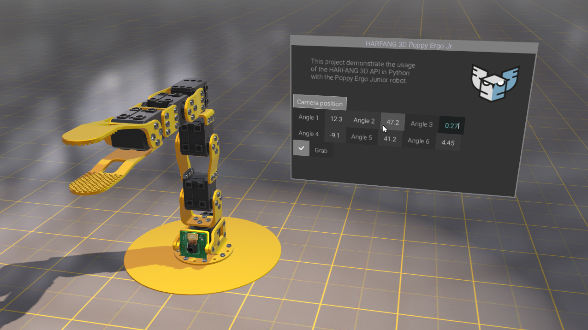

# Harfang UI

**Harfang UI** is a _immediate mode_ GUI library built on top of HARFANG® 3D.
It supports 2D, 3D & VR (wip). 
Harfang GUI was created by [Eric Kernin](https://github.com/ErkMkd)

___
## Overview  
* Easy 2D/3D/VR GUI creation with HARFANG® 3D Python
* Immediate mode, inspired by the API of [DearImGui](https://github.com/ocornut/imgui)

## Requirements

* Python 3.6+
* HARFANG 3D for Python
___
## Widgets types

The current version of the Harfang GUI API provides the following widgets:

- Window 2D / 3D  
- Info text  
- Button  
- Button image  
- Image  
- Check box  
- Input text  
- Scrollbar (vertical & horizontal)  
- Radio image button
- Toggle button
- Toggle image
- ListBox
- Slider float
- Widgets group

## How to use Harfang UI?

>Please check the code samples to see how to use the library. 
See the `samples/` folder.

## How to run the samples?

1. Download the [wheel package](https://github.com/harfang3d/harfang-gui/releases)
1. Install Harfang UI : `pip install harfangui-2.0.0-py3-none-any.whl`
1. Clone this repository : `git clone https://github.com/harfang3d/harfang-gui.git`
1. Open the local repository in VSCode
1. Run the samples found in `samples/`
   - :warning: The first run might be a bit long, as the graphic assets need to be compiled.
